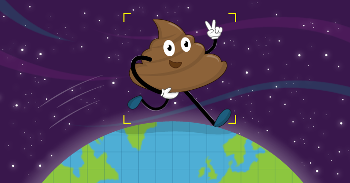

# Poo near you

In this resource you will use the Google maps API to put open data onto a map using JavaScript

## Licence

Unless otherwise specified, everything in this repository is covered by the following licence:

***Poo near you*** by the [Raspberry Pi Foundation](http://www.raspberrypi.org) is licenced under a [Creative Commons Attribution 4.0 International License](http://creativecommons.org/licenses/by-sa/4.0/).

Based on a work at https://github.com/raspberrypilearning/poo-near-you
