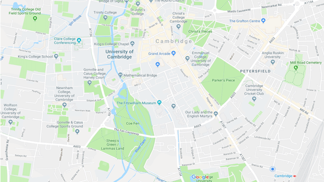

## Introduction

In this resource you will use JavaScript and the Google Maps API to put open data onto a map. In our example, we've used location data and placed poo emojis as markers onto a map.

### What you will make

--- collapse ---

---
title: What you will need
---

### Hardware

* Computer (PC/Mac/Raspberry Pi)

### Software

To complete this resource, you will need a Google account to create a Google Maps API key.

Although this resource does not use Python, you will need Python 3 installed to complete the second worksheet, where you will be using the built-in Python 3 webserver.

--- /collapse ---

--- collapse ---

---
title: What you will learn
---

By mapping open data, you will learn:

- How to create a simple web page using HTML and CSS
- How to use the Google Maps API
- How to use JavaScript to read JSON data

This resource covers elements from the following strands of the [Raspberry Pi Digital Making Curriculum](https://www.raspberrypi.org/curriculum/):

- [Apply abstraction and decomposition to solve more complex problems](https://www.raspberrypi.org/curriculum/programming/developer)
- [Engage and share with the digital making community](https://www.raspberrypi.org/curriculum/community-and-sharing/creator)

--- /collapse ---
