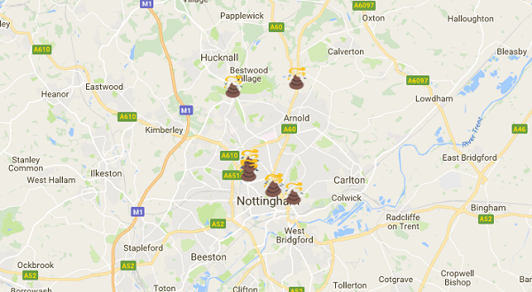

## Read the JSON data and plot it on the map

- Load up the [Open Data Nottingham](http://www.opendatanottingham.org.uk/dataset.aspx?id=124) page in your web browser.

- Right click on **JSON Fixed Penalty Notices 2016** and choose to save the file. Name it `penalties.json` and make sure you save it into the same folder as your webpage.

- Now go back to your text editor and look at the code for your web page. Locate the `</head>` tag, and paste in this line of code on the line immediately before it:

    ```html
    <script src="http://code.jquery.com/jquery-latest.js"></script>
    ```

    This line of code lets us use jQuery, which is a useful JavaScript library that we will use to process the JSON data.

- Now locate the line of code beginning `var incident_location`. Delete this line and replace it with a variable telling us where the JSON file is:

    ```JavaScript
    var data_file = "http://localhost:8000/penalties.json";
    ```

    You will notice that we have specified the path to this file as being on `localhost` - this means the file will be __served__ through the web server, rather than accessed as a file on your computer. This is very important - without this, JavaScript will not allow us to use the JSON file.

- Immediately after the line you just added, add in the following code which reads data from the JSON file:

    ```JavaScript
    $.getJSON(data_file, function(data){

    });
    ```

- The JSON file has lots of data in it, so instead of only processing one piece of data, we need to process a lot of them - we are going to need a loop. Between the opening and closing curly brackets, add some code to loop through __each__ of the objects returned by the JSON file. Your code should now look like this:

    ```JavaScript
    $.getJSON(data_file, function(data){
        $.each(data, function(i){

        });
    });
    ```

- Inside the curly brackets belonging to the `$.each` loop, create a variable containing the location.

    ```JavaScript
    var incident_location =  data[i]["Street"] + ", Nottingham, UK";
    ```

    Here's what this code does:
    - `var incident_location =` - Create a variable called `incident_location` (this is deliberately the same name as the variable we deleted earlier)
    - `data[i]["Street"]` - The `$getJSON` function gives us the `data` from the JSON file. Each time the `$.each` loop runs, it looks at a new item of data. The item it is currently looking at is item `[i]`. From the current data, we want to look specifically at the `["Street"]`
    - `+ ", Nottingham UK"` - We are adding on "Nottingham, UK" to the street name. This is so the Geocoder has a bit more information about the location when it looks it up - for example there may be lots of streets in the UK with the same name, so we need to be specific that we want the one in Nottingham.

- We will only plot the first ten items from the data. This is because using the geocoder is "expensive" in computational terms, so Google Maps has a quota on how many geocodes you can do per day, and how quickly you can do them. If you attempt to geocode all of the data at once, your code will fail after the first ten. You will be making requests too quickly for the geocoder API, and Google will stop letting you use the geocoder! Add in this block of code immediately after `var incident_location` to tell the loop to stop after the first ten results:

    ```JavaScript
    if( i == 10 ){ return false; }
    ```

- Now highlight all of your existing `geocoder` code. Move this code so that it is also inside the curly brackets, immediately after the `if` statement you added in the previous step. Your final code should look like this:

    ```JavaScript
    $.getJSON(data_file, function(data){
        $.each(data, function(i){
            var incident_location =  data[i]["Street"] + ", Nottingham, UK";

            if( i == 10 ){ return false; }

            geocoder.geocode( { 'address': incident_location }, function(results) {
                var emoji = 'poop.png';
                var marker = new google.maps.Marker({
                    map: map,
                    position: results[0].geometry.location,
                    animation: google.maps.Animation.DROP,
                    icon: emoji
                });

            });
        });
    });
    ```

- Save your file and then refresh the page being served from `http://localhost:8000/index.html`. You should see ten locations marked on your map!

    

