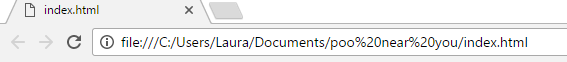

## Why did we need to run a web server?

We need to __serve__ our webpage via a web server so that we can process the JSON data.

When data is hosted on the web, web servers have to be careful that they do not open themselves up to attacks from hackers. You may have seen warnings before about cross-site scripting attacks (or XSS for short), which can allow hijackers to put their own malicious code on normal, legitimate websites. To stop this from happening, web browsers operate a **same origin policy**, which means that code on webpage 1 can only access data from webpage 2 if both pages are of the same origin (which very roughly means "are hosted on the same server").

So now we have a problem. We want our web page to access the JSON data, but our script will not be running on the same server as the data.

**Why can't I just download the JSON file from the data source and access it as a file on my computer?**

When you look at your webpage by just opening it up in the web browser, the address will start with `file://`, as will the JSON file if it is saved on your computer.

  

For security reasons, JavaScript doesn't allow you to access local files (files on the same computer) so this approach won't work.

**The fix - download the JSON file and serve it up via a local web server**

This is the method we used, and here's why it works. By running the simple Python web server, you are making your computer "serve" up the pages to your web browser. When you visit `http://localhost:8000` it is similar to when you visit a real website - you are making a request to a server which then sends you back the page you asked for.

If you put your `index.html` file on your web server, and then access it as `http://localhost:8000/index.html`, its **origin** is `http://localhost:8000`. If you also send your JSON file via the web server, it can be accessed at `http://localhost:8000/penalties.json` and so its **origin** is __also__ `http://localhost:8000`. This satisfies the same origin rule, and so we are able to access the JSON data in our JavaScript!

Incidentally, some web servers offering JSON data are set up to send a special header allowing access from different origins. The server with the data used in this resource does not have this set up, so we downloaded the file and served it locally.

