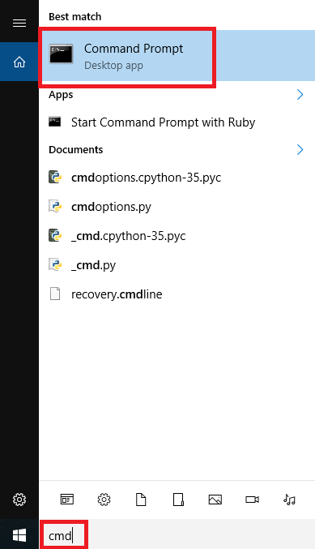
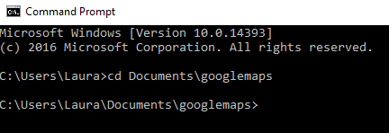
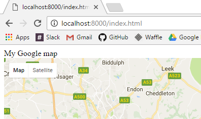

## Run a local web server

So far, you have learnt how to mark a location on a map by finding its latitude and longitude, and you know how to customise the marker as an emoji. The data file we looked at contains a lot of data though, and typing lots of things in would take a long time. Let's get the computer to automatically retrieve the data and plot it on the map for us!

The open data we found was in a format called JSON (JavaScript Object Notation) which is easy to read and work with using JavaScript. You may find many other open data sources as JSON, and you can access these using the methods we will show you. To be able to read the data automatically, you will need to run a web server on your computer. Fortunately, as long as you have Python 3 installed, you already have the capability to run a very basic web server!

**On some networks (for example in schools) the use of the command prompt and certain ports will be restricted, so you may need to ask for support from your network manager to complete this part of the resource.**

### Running a web server

- Open a terminal (Raspberry Pi, Mac) or Command Prompt (Windows):

    **Windows**

    

    **Raspberry Pi**

    

    **Mac**

    


- Change to the directory your web page is saved in by typing `cd` followed by a space, then the path to the directory. An example directory is shown, but you may have saved your web page in a different location, so make sure you use the path to the directory you used. Be careful - Windows uses `\` between directories, but Mac and Raspberry Pi both use `/`.

    **Windows**

    

    **Raspberry Pi**

    ```bash
    cd /home/pi/googlemaps
    ```

    **Mac**

    ```bash
    cd Documents/googlemaps
    ```

- Type the following command to start the web server, which will serve files from the directory you were in when you started it.

    **Windows**

    ```bash
    python -m http.server
    ```

    **Raspberry Pi and Mac**

    ```bash
    python3 -m http.server
    ```

- You should see a message that will be similar to this - `Serving HTTP on 0.0.0.0 port 8000 ...`

- Open up a web browser. In the address bar, type in `http://localhost:8000/index.html` and press enter. You should see your map webpage appear, but this time it is being __served__ to you by the Python web server!

    

You may be curious as to why it is necessary to run a web server. Why can't we just carry on looking at the web page as we did in worksheet 1? The explanation for why this is necessary is at the end of this worksheet.
