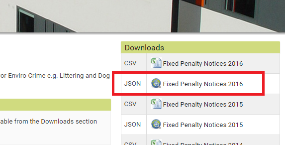
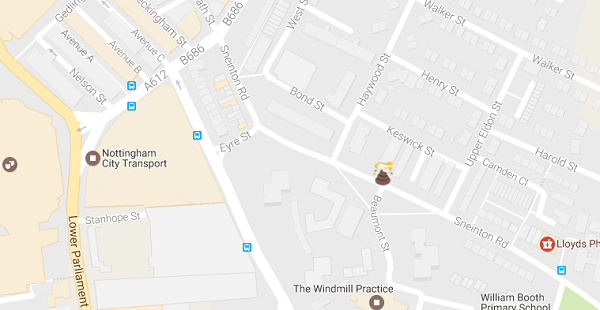

## Set a marker

Let's add a marker onto our map.

- Open up the [Nottingham Open Data page](http://www.opendatanottingham.org.uk/dataset.aspx?id=124) and click on **JSON Fixed Penalty Notices 2016**

    

- You should now see a very long file with lots of text, telling us about fixed penalty notices people were given in Nottingham in 2016. Let's have a look at one of these as an example:

    ```JavaScript
    {
    "json_featuretype":"ncc_Fixed_Penalty_Charge_Notice_2016"
    ,"Issue_Date":"2016-01-04"
    ,"Issue_Day_Of_Week":"Monday"
    ,"Street":"Sneinton Road"
    ,"Contravention_Description":"Failing to remove dog faeces forthwith"
    ,"Amount_Paid(£)":"0"
    ,"Status":"Outstanding"
    ,"BODY":"http://data.ordnancesurvey.co.uk/id/7000000000038857\n"
    ,"BODY_NAME":"Nottingham City Council\n"
    ,"CREATE_DAT":"20160704"
    }
    ```

    We can see from the `Contravention_Description` that this person was naughty and didn't clean up some dog poo! The part we are interested in at the moment is the `Street` which is "Sneinton Road".

- To be able to place a marker on the map, we need to know the **latitude** and **longitude** where the marker should be placed. It would be a bit annoying having to look up the latitude and longitude ourselves on Google Maps for every single marker, so let's get the computer to find it out for us! Locate the `}` just before the `</script>` tag. Add this code **before** the `}` symbol:

    ```JavaScript
    var geocoder = new google.maps.Geocoder();
    var incident_location = "Sneinton Road, Nottingham, UK";

    geocoder.geocode( { 'address': incident_location }, function(results) {

        var marker = new google.maps.Marker({
            map: map,
            position: results[0].geometry.location,
        });

    });
    ```

    Here's what this code does as pseudo code:

    ```html
    SET UP a geocoder (finds lat/lng from addresses)
    VAR incident_location EQUALS "Sneinton Road, Nottingham, UK"

    USING geocoder FIND lat/lng OF incident_location
        CREATE marker
            ADD TO map
            POSITION at the lat/lng found
        END marker
    END geocoding

    ```
- Save your code and refresh your web page in the browser. Check that a marker was placed on Sneinton Road in Nottingham - you may need to zoom in to see!

    

- We can make our markers a bit more interesting by animating them and changing the image. Position your cursor on a blank line immediately after the line of code where you set the position of the marker, and add the following line of code:

    ```html
    animation: google.maps.Animation.DROP,
    ```

- Go back to your map in the web browser and refresh the page. You should now see the pin drop from the sky when the map loads!

- Since we are mapping places where people got fined for leaving dog poo, why don't we change the marker to be a poo emoji instead! You can find lots of emojis at [Wikimedia commons](https://commons.wikimedia.org/wiki/Emoji).

- Save a poo emoji into the same folder as your web page, and call it `poop.png`. You can use [this one](resources/poop.png) if you like.

- Add a line of code immediately before the line that begins `var marker` to create a variable containing the filename of our poo emoji:

    ```JavaScript
    var emoji = 'poop.png';
    ```

- Now add the following code on the line after your `animation:`, inside the section where you create the marker. This will set the icon of the marker to be the poo emoji picture:

    ```JavaScript
    icon: emoji
    ```

- The full code should now look like this:

    ```JavaScript
    var geocoder = new google.maps.Geocoder();
    var incident_location = "Sneinton Road, Nottingham, UK";

    geocoder.geocode( { 'address': incident_location }, function(results) {
        var emoji = 'poop.png';
        var marker = new google.maps.Marker({
            map: map,
            position: results[0].geometry.location,
            animation: google.maps.Animation.DROP,
            icon: emoji
        });

    });
    ```

- Save your code, go back to your browser and refresh the page. You should see a poop emoji appear instead of a marker!

    

    When I did this, the emoji I saved was quite big so it covered the whole of Nottingham with poo (and made me laugh a lot!) If your emoji is too big, you can resize it using an image editing program, or you could download and use [this small one](resources/poop.png) instead.

    

    Phew, that's better!

The full code from this section can be seen [here](https://raw.githubusercontent.com/raspberrypilearning/poo-near-you/master/code/worksheet1.html)

