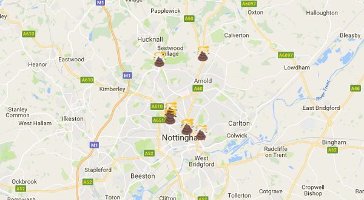

## JSON डेटा पढ़ें और इसे map पर प्लॉट करें

- आपके वेब ब्राउज़र में [ डेटा नॉटिंघम ](http://www.opendatanottingham.org.uk/dataset.aspx?id=124) पेज लोड करें ।

- ** JSON फिक्स्ड पेनल्टी नोटिस 2016 ** पर राइट क्लिक करें और फ़ाइल को सेव़ करने के लिए चुनें। इसे नाम दें `penalties.json`और सुनिश्चित करें कि आप इसे अपने वेबपेज के समान फ़ोल्डर में हैं।

- अब अपने टेक्स्ट एडिटर पर वापस जाएं और अपने वेब पेज के कोड को देखें। `</head>` टैग का पता लगाएँ और कोड में इस लाइन से पहले की लाइन में पेस्ट करें :

    ```html
    <script src="http://code.jquery.com/jquery-latest.js"></script></script><script src="http://code.jquery.com/jquery-latest.js">
    ```

    कोड की यह लाइन हमें jQuery का उपयोग करने देती है, जो एक उपयोगी JavaScript(JavaScript) लाइब्रेरी है जिसका उपयोग हम JSON डेटा को प्रोसेस करने के लिए करेंगे।

- अब ` var event_location ` कोड की शुरुआत की लाइन का पता लगाएं । इस लाइन को हटाएं और इसे एक वेरिएबल के साथ बदलें जिसमें हमें बताया गया है कि JSON फ़ाइल कहां है:

    ```JavaScript
    var data_file = "http: // localhost: 8000 / penalties.json";
    ```

    आप देखेंगे कि हमने इस फ़ाइल का पथ निर्दिष्ट किया है जैसा कि ` लोकलहोस्ट(local host)` पर है - इसका मतलब है कि फ़ाइल __ served __ कि जायेगी जो वेब सर्वर के माध्यम से, बजाय आपके कंप्यूटर पर एक फ़ाइल के रूप में इस्तेमाल हुए। यह बहुत महत्वपूर्ण है - इसके बिना JavaScript(JavaScript) हमें JSON फ़ाइल का उपयोग करने की अनुमति नहीं देगा।

- आपके द्वारा जोड़ी गई लाइन के तुरंत बाद, निम्न कोड जोड़ें जो JSON फ़ाइल से डेटा पढ़ता है:

    ```JavaScript
    $.getJSON(data_file, function(data){

    })
    ```

- JSON फ़ाइल में बहुत सारे डेटा होते हैं, इसलिए डेटा के केवल एक टुकड़े को संसाधित(process) करने के बजाय, हमें उनमें से कई को संसाधित(process) करने की आवश्यकता है - हमें एक लूप की आवश्यकता होने वाली है। Curly brackets खोलने और बंद करने के बीच, __प्रत्येक __JSON फ़ाइल द्वारा दिए गए ऑब्जेक्ट्स को कुछ कोड के माध्यम से लूप में जोड़ें । आपका कोड अब इस प्रकार दिखेगा:

    ```JavaScript
    $.getJSON(data_file, function(data){
        $.each(data, function(i){

        });
    });
    ```

- Inside brackets के अंदर से संबंधित ` $.each ` लूप, एक वैरिएबल बनाएं जिसमें स्थान हो।

    ```JavaScript
    var incident_location =  data[i]["Street"] + ", Nottingham, UK";
    ```

    ये कोड ये करता है:
    - `var incident location ` - ` event_location ` नामक एक वेरिएबल बनाएं(यह जानबूझकर वैसा ही नाम है जैसा हमने पहले डिलीट किया था)
    - `data[i]["Street"]` - `$getJSON` फ़ंक्शन हमेंJSON फ़ाइल से ` डेटा` देता है । हर बार ` $.each` लूप चलता है, यह डेटा के एक नए आइटम को देखता है। वर्तमान में जिस आइटम को देख रहा है वह आइटम `[i]` है । वर्तमान डेटा से, हम विशेष रूप से ` ["Street"]`देखना चाहते हैं
    - ` + ", Nottingham UK ` - हम सड़क के नाम पर " Nottingham, UK जोड़ रहे हैं। यह इसलिए है कि जियोकोडर के पास स्थान के बारे में थोड़ी अधिक जानकारी होती है जब वह इसे देखता है - उदाहरण के लिए ब्रिटेन में एक ही नाम से बहुत सारी सड़कें हो सकती हैं, इसलिए हमें विशिष्ट होना चाहिए कि हम नॉटिंघम में चाहते हैं।

- हम केवल पहले दस आइटम को डेटा से प्लॉट करेंगे। ऐसा इसलिए है क्योंकि कम्प्यूटेशनल शब्दों में जियोकोडर का उपयोग करना "महंगा" है, इसलिए Google मैप्स पर एक कोटा है कि आप प्रति दिन कितने जियोकोड्स कर सकते हैं, और कितनी जल्दी आप उन्हें कर सकते हैं। यदि आप एक बार में सभी डेटा को जियोकोड करने का प्रयास करते हैं, तो आपका कोड पहले दस के बाद विफल(Fail) हो जाएगा। आप जियोकोडर एपीआई(API) के लिए बहुत जल्दी अनुरोध कर रहे हैं, और Google आपको जियोकोडर का उपयोग करने देना बंद कर देगा! ` var incident_location` के तुरंत बाद कोड के इस ब्लॉक में जोड़ें लूप को बताने के लिए की पहले दस परिणामों के बाद बंद करना है:

    ```JavaScript
    if( i == 10 ){ return false; }
    ```

- अब अपने सभी मौजूदा ` जियोकोडर` कोड को हाइलाइट करें । इस कोड को स्थानांतरित करें ताकि यह curly brackets के अंदर भी हो, `if`के तुरंत बाद जो आपने पिछले चरण(step) में जोड़ा है। आपका कोड इस तरह दिखना चाहिए:

    ```JavaScript
    $.getJSON(data_file, function(data){
        $.each(data, function(i){
            var incident_location =  data[i]["Street"] + ", Nottingham, UK";

            if( i == 10 ){ return false; }

            geocoder.geocode( { 'address': incident_location }, function(results) {
                var emoji = 'poop.png';
                var marker = new google.maps.Marker({
                    map: map,
                    position: results[0].geometry.location,
                    animation: google.mapsAnimation.DROP,
                    icon: emoji
                });

            });
        });
    });
    ```

- अपनी फ़ाइल सेव करे और फिर ` http: // localhost: 8000 / index.html `से दी जा रहे पेज को ताज़ा करें । आपको अपने नक्शे पर चिह्नित दस स्थानों दिखने चाहिए!

    

