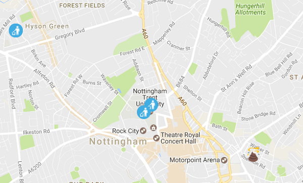

## विभिन्न इमोजी का उपयोग करना

आप देखेंगे कि बहुत सारी घटनाएं कुत्ते के पू से नहीं होती हैं - वे वास्तव में कूड़े को छोड़ने के साथ होती हैं। आइए घटना के प्रकार के आधार पर एक अलग इमोजी जोड़ें।

- कूड़े को गिराए जाने के लिए एक उपयुक्त इमोजी सहेजें। इमोजी को `litter.png` के रूप में सेव़ करना चाहिए और इसे आपके वेबपेज के समान फ़ोल्डर में सेव़ करना चाहिए। यदि आप चाहते हैं, तो आप[ इस का](resources/litter.png) उपयोग कर सकते हैं [ Wikimedia Commons ](https://commons.wikimedia.org/wiki/Emoji)से ।

- घटना के प्रकार की जाँच करने के लिए एक 'if' स्टेटमेंट जोड़ें। यदि यह कूड़े है, तो कूड़े का इमोजी का उपयोग करने के लिए variable को बदलें। अन्यथा, हम डिफ़ॉल्ट पूप इमोजी के साथ चिपके रहेंगे।

    ```javascript
    if(data[i]["Contravention_Description"].toLowerCase() == "leaving litter"){
        emoji = 'litter.png';
    }
    ```

    हमने ` Contravention_Description ` को lowercase में परिवर्तित कर दिया है क्योंकि डेटा में कुछ विवरण "Leaving litter" कहते हैं और कुछ "Leaving Litter" कहते हैं। हालांकि एक मानव समझ सकता है कि इन दोनों का मतलब एक ही है, कंप्यूटर सोचता है कि वे अलग हैं। हम विवरण को सभी lowercaseमें परिवर्तित करते हैं और फिर इसकी तुलना "leaving litter"सभी लोअरकेस से करते हैं, ताकि पूंजीकरण से कोई फर्क न पड़े।

- अपना कोड सहेजें(Save करे), अपने ब्राउज़र पर वापस जाएं और पेज को रीफ़्रेश करें। विभिन्न प्रकार की घटनाओं को दिखाने के लिए आपको दो अलग-अलग प्रकार के इमोजी दिखने चाहिए।

    

- कोड [यहां ](https://raw.githubusercontent.com/raspberrypilearning/poo-near-you/master/code/worksheet2.html) समाप्त है आपके देखने के लिए ।

