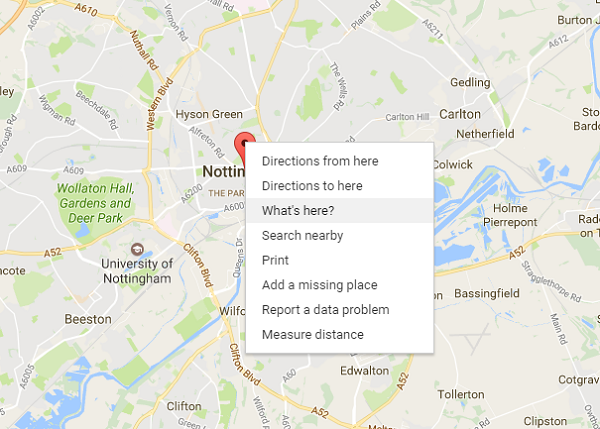

## एक अक्षांश और देशांतर ढूँढना

हमें Google मानचित्र को यह बताने में सक्षम होना चाहिए कि हमारे मानचित्र पर कौन सा क्षेत्र दिखाना है।

- एक वेब ब्राउज़र में[ Google Maps](http://maps.google.com) खोलें ।

- शीर्ष बाईं ओर खोज(search) बॉक्स में, उस स्थान को टाइप करें जिसे आप खोज(search) रहे हैं। चूँकि हम जो डेटा उपयोग कर रहे हैं वह ब्रिटेन के नॉटिंघम का है, यह वह है जो हम टाइप करेंगे। शीर्ष बाईं ओर खोज(search) बॉक्स में, उस स्थान को टाइप करें जिसे आप खोज(search) रहे हैं।

    

- आपके द्वारा खोजे गए स्थान को मैप करते हुए एक लाल मार्कर के साथ एक नक्शा दिखाई देना चाहिए। लाल मार्कर पर राइट क्लिक करें और चुनें ** यहाँ क्या है? ** ।

    

- तल(Bottom) पर, एक छोटा बॉक्स पॉप अप करना चाहिए, और इसमें एक स्थानीय स्थान का नाम हो सकता है। इन मूल्यों(values) को संभाल कर रखें क्योंकि हमें एक मिनट में उनकी आवश्यकता होगी। इन मूल्यों(values) को संभाल कर रखें क्योंकि हमें एक मिनट में उनकी आवश्यकता होगी।

    

