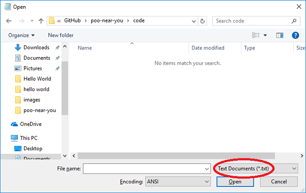

## अपने वेब पेज पर Map जोड़ें

- यदि आपने अपने वेबपेज के लिए कोड बंद कर दिया है, तो अपने टेक्स्ट एडिटर (जैसे नोटपैड) खोलें और टेक्स्ट एडिटर के अंदर से `index.html` फ़ाइल फिर से खोलें। यदि आप नोटपैड का उपयोग कर रहे हैं, तो आपको "टेक्स्ट फाइल्स" से ड्रॉप डाउन को "ऑल फाइल्स" में बदलना होगा (नीचे सर्किल किया गया होगा) अन्यथा आप HTML फाइल नहीं देख पाएंगे।

    

    

- अपनी `index.html` फ़ाइल पर वापस जाएँ और `<head>` टैग कोआपके कोड में खोजे। इस टैग के बाद लाइन पर अपना कर्सर रखें और निम्न कोड जोड़ें:

    ```html
    <style>
        #map {
            width: 100%;
            height: 400px;
            background-color: grey;
        }
    </style>
    ```

    यह कुछ CSS कोड है जो आपकी स्क्रीन की पूरी चौड़ाई लेने के लिए Map को बताएगा, और 400px उच्च होगा। यदि आप चाहें तो Map को बड़ा या छोटा करने के लिए आप इन मूल्यों को बदल सकते हैं।

- अब अपने कोड में वाक्य का पता लगाएं जो कहता है कि `मेरा Map यहां जाएगा` । इस वाक्य को हटा दें - हम इसके स्थान पर Map जोड़ने जा रहे हैं!

- एक `<div>` (एक अदृश्य बॉक्स) बनाने के लिए निम्नलिखित कोड जोड़ें जहां आपका Map अंततः दिखाई देगा:

    ```html
    My Google map
    <div id="map"></div><div id="map"></div>
    ```

- आपके द्वारा अभी जोड़े गए `<div>` कोड के ठीक नीचे, Map बनाने के लिए निम्नलिखित कोड जोड़ें।

    ```html
    <script>

        function initMap() {

            var Nottingham = {lat: #, lng: #};

            var map = new google.mapsMap(document.getElementById('map'), {
                zoom: 10,
                center: Nottingham
            });
        }
    </script>
    ```

- कोड की पंक्ति को देखें जो `var Nottingham` से शुरू होता है । `#` को नॉटिंघम के अक्षांश और देशांतर मानों से बदलें जो आपने Google Map पर देखे थे। पहला वाला अक्षांश या `lat` हैऔर दूसरा एक देशांतर या `lng` है ।

    ```html
    var Nottingham= {lat: 52.961034, lng: -1.158733};
    ```
    (आपके सटीक value थोडी अलग हो सकती हैं, "यहाँ क्या है?" के आधार पर - यह ठीक है!)

- अपना कोड सहेजें(Save करे)। अब अपने वेब ब्राउज़र में `index.html` पर वापस जाएँ। पेज को ताज़ा करें और आपको मानचित्र के केंद्र में नॉटिंघम के साथ प्रदर्शित Google Map दिखना चाहिए।

