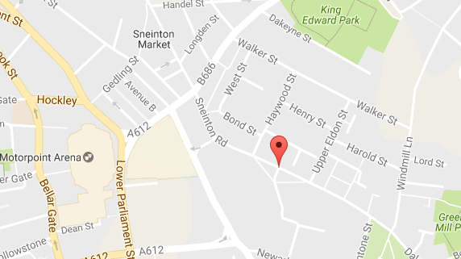

## एक मार्कर सेट करें

हमारे Map पर एक मार्कर जोड़ते हैं।

- [ नॉटिंघम ओपन डेटा पेज](http://www.opendatanottingham.org.uk/dataset.aspx?id=124) खोलें और ** JSON फिक्स्ड पेनल्टी नोटिस 2016** पर क्लिक करें

    

- अब आपको बहुत सारे टेक्स्ट के साथ एक बहुत लंबी फ़ाइल दिखनी चाहिए, जिसमें हमें बताया गया है कि 2016 में नॉटिंघम में लोगों को निश्चित दंड नोटिस दिए गए थे। आइए एक उदाहरण के रूप में इनमें से एक को देखें:

    ```JavaScript
    {
    "json_featuretype":"ncc_Fixed_Penalty_Charge_Notice_2016"
    ,"Issue_Date":"2016-01-04"
    ,"Issue_Day_Of_Week":"Monday"
    ,"Street":"Sneinton Road"
    ,"Contravention_Description":"Failing to remove dog faeces forthwith"
    ,"Amount_Paid(£)":"0"
    ,"Status":"Outstanding"
    ,"BODY":"http://data.ordnancesurvey.co.uk/id/7000000000038857\n"
    ,"BODY_NAME":"Nottingham City Council\n"
    ,"CREATE_DAT":"20160704"
    }
    ```

    हम ` Contravention_Description` से देख सकते हैं यह व्यक्ति नटखट था और कुछ कुत्ते की पू को साफ नहीं करता था! फिलहाल हम जिस हिस्से में रुचि रखते हैं वह है ` Street` जो "Sneinton Road" है।

- टैग से ठीक पहले**}**लगाएँ जो**</1></0  Google Maps पर हर एक मार्कर के लिए अक्षांश और देशांतर को देखना थोड़ा कठिन होगा, तो आइए इसे जानने के लिए कंप्यूटर का प्रयोग करें टैग से ठीक पहले`}`लगाएँ जो`</script></0 टैग से ठीक पहले<strong x-id="1">}</strong>लगाएँ जो<0> `</0>

    ```JavaScript
    var geocoder = new google.maps.Geocoder();
    var incident_location = "Sneinton Road, Nottingham, UK";

    geocoder.geocode( { 'address': incident_location }, function(results) {

        var marker = new google.maps.Marker({
            map: map,
            position: results[0].geometry.location,
        });

    });
    ```
</p>

    ये कोड pseudo कोड के रूप में क्या करता है:

    ```html
    SET UP a geocoder (finds lat/lng from addresses)
    VAR incident_location EQUALS "Sneinton Road, Nottingham, UK"

    USING geocoder FIND lat/lng OF incident_location
        CREATE marker
            ADD TO map
            POSITION at the lat/lng found
        END marker
    END geocoding

    ```
</li>

- अपना कोड सेव (save) करें और अपने इंटरनेट ब्राउज़र को ताज़ा(Refresh) करें। जांचें कि नॉटिंघम में स्नेनटन रोड पर एक मार्कर रखा गया था - आपको देखने के लिए ज़ूम इन करना पड़ सकता है!

    

- हम अपने मार्करों को एनिमेटेड करके और छबि को बदलकर थोड़ा अधिक रोचक बना सकते हैं। अपने कर्सर को कोड की लाइन के तुरंत बाद एक खाली लाइन पर रखें जहां आपने मार्कर की स्थिति निर्धारित की है, और कोड की निम्नलिखित लाइन जोड़ें:

    ```html
    animation: google.maps.Animation.DROP
    ```
</ul>

यदि आप यह पता लगाने के लिए संघर्ष कर रहे हैं कि आपने मार्कर की स्थिति कहाँ निर्धारित की है, तो ऊपर दिए गए pseudo कोड पर एक नज़र डालें।

- वेब ब्राउजर में अपने मैप पर वापस जाएं और पेज को रिफ्रेश करें। मैप लोड होने पर आपको अब आसमान से पिन ड्रॉप दिखना चाहिए!

- चूँकि हम उन जगहों की मैपिंग कर रहे हैं जहाँ लोगों को कुत्ते की पू छोड़ने के लिए जुर्माना मिला है, इसलिए हम इसके बदले मार्कर को पू इमोजी बना के क्यों नहीं बदलते! आप [ Wikimedia commons](https://commons.wikimedia.org/wiki/Emoji) पर बहुत सारी इमोजी पा सकते हैं ।

- अपने वेब पेज के समान फ़ोल्डर में एक पू इमोजी को सहेजें, और इसे ` poop.png` बुलाये । आप [इस का](resources/poop.png) उपयोग कर सकते हैं यदि आप चाहते हैं।

- ` var marker` से शुरू होने वाली लाइन से ठीक पहले कोड की एक पंक्ति जोड़ें, हमारे पू इमोजी के फ़ाइल नाम से एक variable बनाने के लिए:

    ```JavaScript
    var emoji = 'poop.png';
    ```

- अब अपने ` animation:` के बाद लाइन पर निम्न कोड जोड़ें:, उस अनुभाग के अंदर जहां आप मार्कर बनाते हैं। यह मार्कर के आइकन को पू इमोजी पिक्चर के रूप में सेट करेगा:

    ```JavaScript
    icon: emoji
    ```

- आपका कोड अब इस प्रकार दिखना चाहिए:

    ```JavaScript
    var geocoder = new google.mapsGeocoder();
    var incident_location = "Sneinton Road, Nottingham, UK";

    geocoder.geocode( { 'address': incident_location }, function(results) {
        var emoji = 'poop.png';
        var marker = new google.maps.Marker({
            map: map,
            position: results[0].geometry.location,
            animation: google.maps.Animation.DROP,
            icon: emoji
        });

    });
    ```

- अपना कोड सहेजें, अपने ब्राउज़र पर वापस जाएं और पेज को रीफ़्रेश करें। आपको एक पू इमोजी दिखना चाहिए बजाय एक मार्कर के!

    

    जब मैंने ऐसा किया, तो जो इमोजी मैंने save करी वह काफी बड़ी थी, इसलिए इसने पूरे नॉटिंघम को पू से ढक दिया (और मुझे बहुत हँसाया!)। यदि आपका इमोजी बहुत बड़ा है, तो आप इमेज एडिटिंग प्रोग्राम का उपयोग करके आकार बदल सकते हैं, या आप डाउनलोड और उपयोग कर सकते हैं [ यह छोटा ](resources/poop.png)।

    

    भई, यह बेहतर है!

इस अनुभाग से पूर्ण कोड[ यहां](https://raw.githubusercontent.com/raspberrypilearning/poo-near-you/master/code/worksheet1.html)देखा जा सकता है
