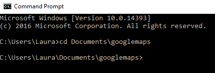

## एक स्थानीय(local) वेब सर्वर चलाएं

अब तक, आपने सीखा है कि किसी Map पर किसी स्थान को उसके अक्षांश और देशांतर को कैसे चिह्नित किया जाए, और आप जानते हैं कि मार्कर को इमोजी के रूप में कैसे अनुकूलित किया जाए। हमारे द्वारा देखी गई डेटा फ़ाइल में बहुत अधिक डेटा है, और बहुत सी चीजें टाइप करने में लंबा समय लगता है। चलो कंप्यूटर को डेटा को स्वचालित रूप से प्राप्त करने और इसे हमारे लिए Map पर प्लॉट करने के लिए इस्तेमाल करते है!

हमें जो मुफ्त डेटा मिला, वह JSON (JavaScript ऑब्जेक्ट नोटेशन) नामक एक प्रारूप में था, जो JavaScript का उपयोग करने के साथ पढ़ने और काम करने में आसान है। आपको JSON के रूप में कई अन्य मुफ्त डेटा स्रोत(Sources) मिल सकते हैं, और इन का उपयोग इन तरीकों से कर सकते हैं डेटा को स्वचालित रूप से पढ़ने के लिए, आपको अपने कंप्यूटर पर एक वेब सर्वर चलाने की आवश्यकता होगी। सौभाग्य से, जब तक आपके पास Python 3 स्थापित है, आपके पास पहले से ही एक बहुत ही मूल वेब सर्वर चलाने की क्षमता है!

**कुछ नेटवर्क पर (उदाहरण के लिए स्कूलों में) कमांड प्रॉम्प्ट(command prompt) और कुछ ports का उपयोग प्रतिबंधित होगा, इसलिए आपको संसाधन के इस हिस्से को पूरा करने के लिए अपने नेटवर्क प्रबंधक से समर्थन मांगना पड़ सकता है।**

### वेब सर्वर चलाना

- एक टर्मिनल खोलें (Raspberry Pi, Mac) या कमांड प्रॉम्प्ट(command prompt) (Windows):

    **Windows**

    

    **Raspberry Pi**

    

    **Mac**

    


- अपने वेब पेज को डायरेक्टरी में बदलें ` cd` टाइप करके एक स्थान के बाद, फिर directory का मार्ग। एक उदाहरण निर्देशिका(directory) दिखाई गई है, लेकिन आपने अपने वेब पेज को किसी भिन्न स्थान पर सहेजा होगा, इसलिए सुनिश्चित करें कि आपने जिस निर्देशिका(directory) का उपयोग किया है, उसका उपयोग करें। सावधान रहें - Windows निर्देशिकाओं(directories) के बीच `` \ `का उपयोग करता है, लेकिन Mac और Raspberry Pi दोनों / `का उपयोग करते हैं ``।

    **Windows**

    

    **Raspberry Pi**

    ```bash
    cd / home / pi / googlemaps
    ```

    **Mac**

    ```bash
    cd Documents/googlemaps
    ```

- वेब सर्वर को शुरू करने के लिए निम्न कमांड टाइप करें, जो उस निर्देशिका(directory) से फाइलें प्राप्त करेगा जो आपने इसे शुरू करते समय किया था।

    **Windows**

    ```bash
    python -m http.server
    ```

    **Raspberry Pi and Mac**

    ```bash
    python -m http.server
    ```

- आपको एक संदेश देखना चाहिए जो इसके समान होगा - ` 0.0.0.0 पोर्ट 8000 पर HTTP सर्विंग ... `

- एक वेब ब्राउज़र खोलें। पता(address) बार में, टाइप करें ` http: // localhost: 8000 / index.html ` और एंटर दबाएं। आपको अपना map webpage दिखाई देना चाहिए, लेकिन इस बार इसे __ परोस दिया जा रहा है __ Python वेब सर्वर द्वारा आप के लिए!

    

आप उत्सुक हो सकते हैं कि वेब सर्वर चलाना क्यों आवश्यक है। जैसा कि हमने वर्कशीट 1 में किया था, हम सिर्फ वेब पेज को क्यों नहीं देख सकते? यह क्यों आवश्यक है, इसके लिए स्पष्टीकरण इस वर्कशीट के अंत में है।
