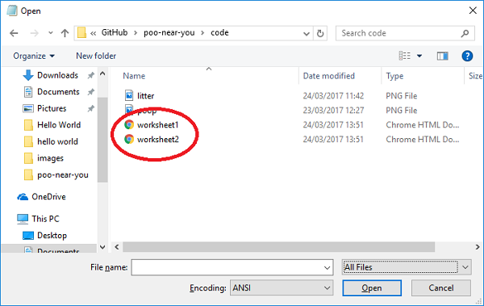

## Add the map to your web page

- If you have closed the code for your webpage, open up your text editor (e.g. Notepad) and, from inside the text editor, reopen the `index.html` file. If you are using Notepad, you will need to change the drop down from "Text files" to "All files" (circled below) otherwise you will not be able to see the HTML files.

    

    

- Go back to your `index.html` file and find the `<head>` tag in your code. Position your cursor on the line after this tag and add the following code:

    ```html
    <style>
    #map {
        width: 100%;
        height: 400px;
        background-color: grey;
    }
    </style>
    ```

    This is some CSS code which will tell the map to take up the whole width of your screen, and be 400px high. You can change these values to make the map larger or smaller if you like.

- Now locate the sentence in your code that says `My map will go here`. Delete this sentence - we're going to add the map in its place!

- Add the following code to create a `<div>` (an invisible box) where your map will eventually appear:

    ```html
    My Google map
    <div id="map"></div>
    ```

- Immediately underneath the `<div>` code you just added, add the following code to create the map:

    ```html
    <script>

        function initMap() {

            var Nottingham = {lat: #, lng: #};

            var map = new google.maps.Map(document.getElementById('map'), {
                zoom: 10,
                center: Nottingham
            });
        }
    </script>
    ```

- Look at the line of code which begins `var Nottingham`. Replace the `#` symbols with the latitude and longitude values for Nottingham which you looked up on the Google Map. The first one is the latitude or `lat` and the second one is the longitude or `lng`.

    ```html
    var Nottingham = {lat: 52.961034, lng: -1.158733};
    ```
    (Your exact values might be slightly different, depending on which attraction was found when you clicked "What's here?" - this is fine!)

- Save your code. Now go back to your `index.html` file in your web browser. Refresh the page and you should see a Google map displayed, with Nottingham at the centre of the map.

