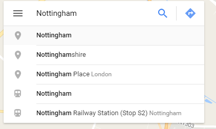
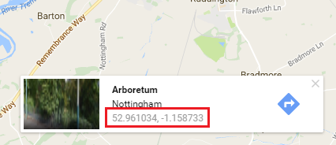

## Finding a latitude and longitude

We need to be able to tell Google Maps which area to show on our map.

- Open [Google Maps](http://maps.google.com) in a web browser.

- In the search box on the top left, type in the place you are searching for. Since the data we are using is from Nottingham in the UK, this is what we will type in. Press enter.

    

- A map should appear with a red marker pinpointing the place you searched for. Right click on the red marker and select **What's here?**.

    

- At the bottom, a small box should pop up, and it might have the name of a local place in it. The name doesn't matter, what we are looking for are the **latitude** and **longitude** values of our place, shown here in the red box. Keep these values handy as we will need them in a minute.

    

