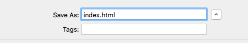
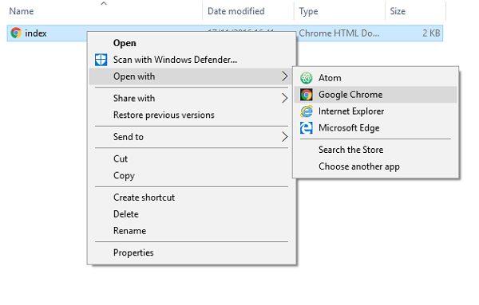

## Create a web page

- Open up a blank file in your chosen text editor and save the file as follows:

 -  If you're using **Notepad** on Windows, type the filename in as `index.html` and change the drop-down for the **Save as** type to **All files**.

  

 - If you're using **TextEdit** on Mac OS, open a new file, then select **Format** > **Make Plain Text**.

  

  Make sure you save the file as `index.html`.

  

 - If you're using **Nano** on a Raspberry Pi, open a terminal window, move to the directory in which you wish to create your web page, and type `nano index.html`.

  

2. This HTML code gives you the basic structure of a page. Copy and paste the code into the file you created, then save the file.

  ```html
  <html>
  <head>
    <title>My map</title>
  </head>
  <body>
    My map will go here
  </body>
  </html>
  ```

3. Go to the folder where you saved your HTML file. Open the file with your internet browser as well. Now you'll have the same file open in your text editor and in your browser at the same time.

  On Windows, you may need to right-click the file, choose **Open with**, and then select your internet browser.

  

  Whenever you change the code in your text editor, save it and then press the refresh button on your browser to see the page update.


